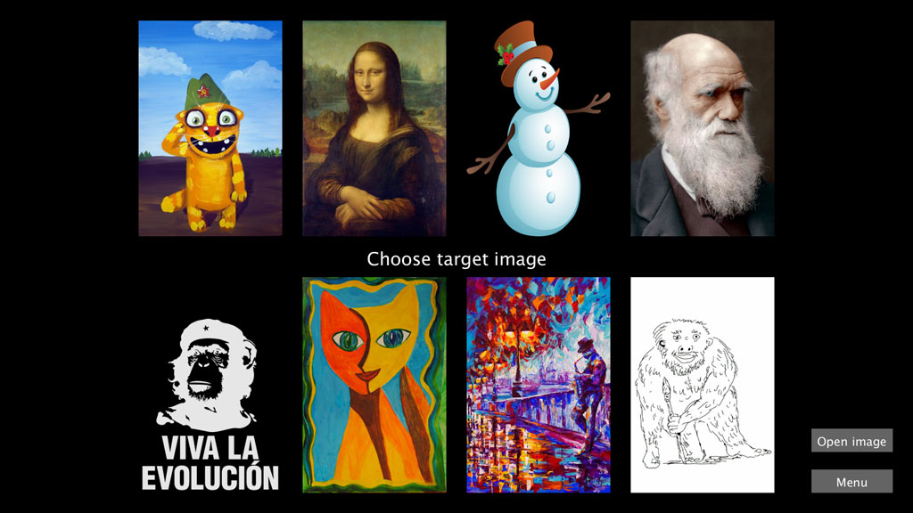
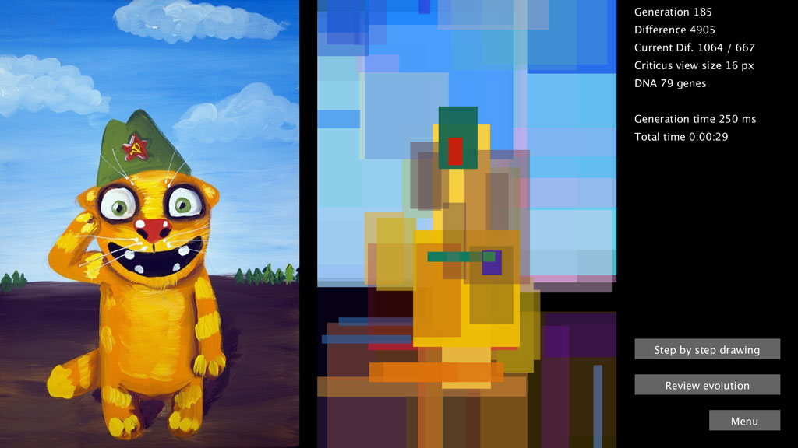
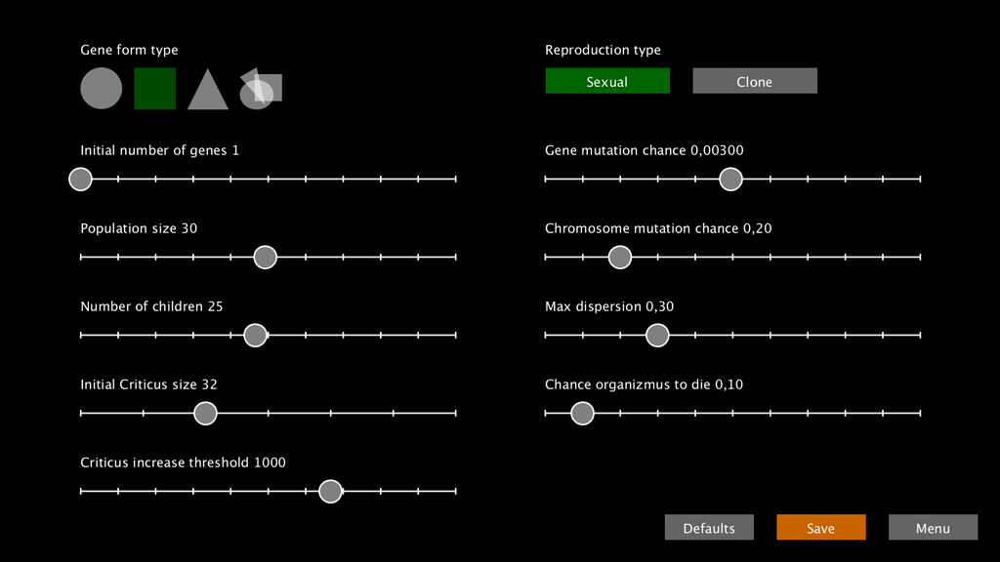
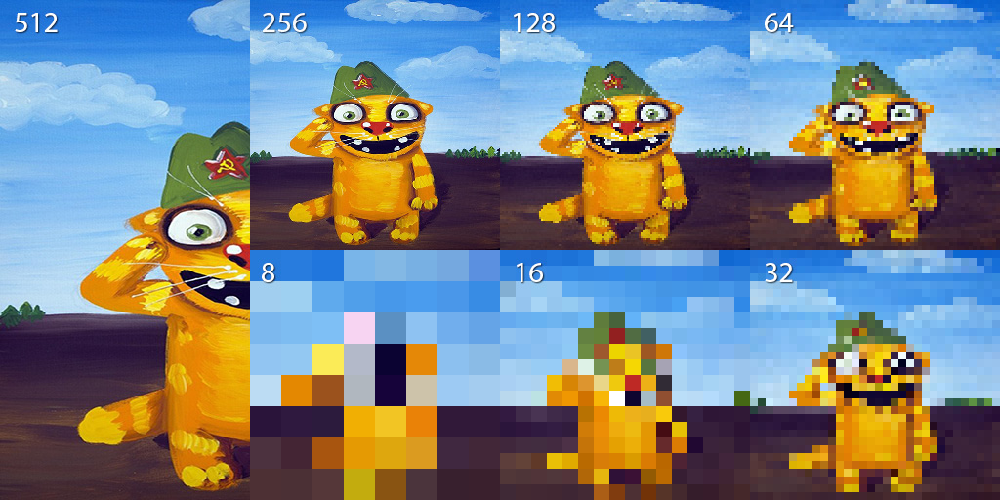

# Эволюция Изоморфов – как выживать?

Дорогие друзья, предлагаем вам взглянуть на маленький кусочек эволюционной гонки и оценить красоту и силу, что скрываются за такими понятиями, как «эволюция», «борьба за существование» и «естественный отбор».

Герои этой бесконечной битвы – Изоморфы – очень просто устроены. У них нет глаз, чтобы видеть опасность, нет ног, чтобы убежать от нее, нет клыков, рогов и когтей, чтобы сопротивляться, нет даже мозгов, чтобы осознать, что с ними происходит. А опасность не дремлет! Страшный хищник Критикус Вульгарис легко ловит бедняжек, придирчиво отбирает самых с его точки зрения уродливых и безжалостно пожирает.

Все, что есть у Изоморфов - это набор случайных разноцветных пятнышек на поверхности прямоугольного тела, складывающихся в причудливые узоры, а также стремление жить и размножаться. Но и этого уже достаточно, чтобы выживать, эволюционировать и добиваться самых невероятных результатов. Надеемся, вы полюбите наших Изоморфов так же, как любим их мы.

## Игровой интерфейс

После запуска игры вас встречает игровое меню со следующими пунктами.

### New Game (Новая Игра)

Самая главная кнопка. Позволяет создать новую популяцию Изоморфов и запустить эволюционный процесс. После нажатия на эту кнопку вам достаточно лишь выбрать картину, которую Критикус Вульгарис считает красивой (а любые другие, соответственно, уродливыми). Дальше все в руках естественного отбора. Критикус жрет уродливых Изоморфов сразу, а менее уродливых чуть погодя. Счастливо выжившие, тут же поспешно размножаются, а их потомки получают случайные мутации, которые ведут к другому рисунку пятнышек на поверхности тела. И тут к Изоморфам на огонек снова заглядывает голодный Критикус…

### Continue (Продолжить)

Возвращает игрока из меню к текущей эволюционирующей популяции. Или же подгружает сохраненную популяцию с диска, если эволюция еще не начата. (пока не реализовано)

### Settings (Настройки)

Вторая самая главная кнопка. Позволяет настроить множество параметров популяции, которые радикальным образом влияют на скорость и направление эволюционного процесса. Параметры можно менять, даже если эволюция уже запущена, хотя в этом случае не все из них окажут влияние на идущий естественный отбор.

Ниже будут перечислены свойства и значения всех изменяемых параметров, но для первого раза можно использовать настройки по умолчанию (кнопка **«Defaults»** ). Они заботливо подготовлены автором программы, чтобы оптимально быстро продемонстрировать работу эволюции и ее результаты.

Не забудьте перед возвратом в меню сохранить измененные параметры кнопкой **«Save»** .

### Help (Помощь)

Открывает в браузере файл с подробной и очень интересной информацией обо всех аспектах игры. Постойте! Ведь именно его вы сейчас и читаете!

### Exit (Выход)

Самая ненужная кнопка. Позволяет выйти из игры. Не смейте ее нажимать, естественный отбор вам этого не простит! Но, если случайно нажали, вы всегда можете вернуться и продолжить эволюционную гонку с того же самого места, или начать новую!

## Есть у эволюции начало...

Нажав пункт меню **«New Game»**, вы попадаете на следующий экран, где вам предстоить сделать самый главный выбор - определиться с эстетическими предпочтениями Критикуса.

Вам на выбор предлагается 8 картин разных жанров и различной художественной ценности. Та картина, которую вы выберите кликом мыши, станет в глазах Критикуса истинным шедевром. Похожих на нее внешне Изоморфов он будет есть в последнюю очередь, а не похожих - в первую.

Картины отличаются не только цветом, но и сложностью для генетического алгоритма. Некоторые эволюция сможет воспроизвести легко, быстро и очень подробно. Для других же потребуется подобрать более удобные настройки. Смотрите, пробуйте, экспериментируйте.

Кнопка **«Open image»** позволяет открыть собственную картинку с диска. Старайтесь выбирать вертикальные изображения во избежание неприятных искажений.

Данная кнопка пока отсутствует в мобильной версии игры. Придётся довольствоваться стандартными картинками на выбор.

Нажав на кнопку **«Menu»** , вы всегда сможете отказаться от такого сложного выбора и вернуться в главное меню игры.

### В разработке:

> Возможность поменять предпочтения Критикуса прямо в процессе эволюции и выбрать другое любимое изображение.

## Нет у эволюции конца!

Рассмотрим подробнее то окно, в котором происходит вывод информации об идущем эволюционном процессе.

### Портрет работы Пабло Пикассо

Основное пространство окна занимают два изображения. Левое - это та картинка, которую вы выбрали на предыдущем шаге. Именно с ним будет сверяться Критикус, чтобы оценить, кто из двух Изоморфов ему не нравится, и кого из них сегодня съесть.

Правое изображение - это портрет лучшего на данный момент Изоморфа в популяции. В каждом поколении лидер меняется, так что статичный портрет превращается в настоящее эволюционное кино-полотно, на котором из хаоса случайно движущихся пятен прямо на ваших глазах проявится узнаваемая картина.

### Статистика

Справа от изображений размещается текстовая статистика, которая показывает текущее состояние популяции, Критикуса и лучшего Изоморфа.

**Generation** - количество поколений Изоморфов, сменившихся с момента старта.

**Difference** - численно выраженное различие между оригинальной картинкой и лучшим Изоморфом в популяции (с точки зрения Критикуса с идеальным зрением). Чем это различиее ниже, тем больше Изоморф похож на любимую картину Критикуса. При значении 0 картинки становятся идентичными.

**Current Dif.** - тот же самый Difference, но уже для реального подслеповатого Критикуса. Через слэш указан порог различия, после достижения которого Критикус улучшит свое зрение.

**Criticus view size** - размер картинки в пикселях, которую на самом деле видит Критикус. Именно этот размер увеличивается при достижении порогового значения из предыдущего пункта.

**DNA** - размер генома лучшего Изоморфа. Каждый ген в геноме отвечает за рисование 1 пятнышка на правой картинке.

**Generation time** - время, за которое происходит обсчет 1 поколения Изоморфов. С увеличением зоркости Критикуса и размера генома это время будет заметно расти, а программа работать все медленнее.

**Total time** - общее время работы эволюционного алгоритма. При правильных настройках результат заметен уже через несколько минут работы, но для получения картинки очень большой точности могут потребоваться часы и даже дни.

### Пошаговое рисование

Нажатие кнопки **«Step by step drawing»** переводит игру в режим пошаговой отрисовки. В этом режиме лучший организм популяции появляется на экране не весь целиком, а постепенно. Рисование начинается с пятна, закодированного первым геном, поверх него рисуется второе, потом третье и так далее до самого последнего пятна и последнего гена.

После рисования последнего гена игра вновь переходит в стандартный режим. Повторное нажатие на кнопку также возвращает игру в стандартный режим.

### Обзор эволюционной истории

Следующая кнопка **«Review evolution»** позволяет ещё раз посмотреть, как проходила эволюция. Нажатие на кнопку переводит игру в режим исторического обзора и показывает по очереди всех лучших Изоморфов от первого до последнего поколения.

После рисования последнего поколения игра вновь переходит в стандартный режим. Повторное нажатие на кнопку также возвращает игру в стандартный режим.

### Выход в меню

Кнопка выхода в главное меню с одноимённым именем **«Menu»** , соответственно, позволяет выйти в главное меню где можно запустить новую игру или поменять настройки.

Для возврата к текущему эволюционному процессу используйте кнопку главного меню **«Continue»**, подсвеченную оранжевым цветом.

### В разработке:

> Сохранение текущего Лучшего Изоморфа в файл в виде векторного изображения, которое можно потом как угодно масштабировать или печатать.
> Вывод на экран графика с прогрессом текущей популяции.

## Settings – почему, отчего, зачем...

У игры довольно много настроек, кажущихся на первый взгляд странными, непонятными, и запутанными, однако все они оказывают то или иное влияние на эволюционный процесс. Правильно подобранные настройки под конкретную картину помогут и Критикусу насытиться, и Изоморфам выжить, и игроку дождаться результата за приемлемое время.

Выбрав необходимые настройки, не забудьте сохранить их кнопкой «Save». Оранжевый цвет кнопки сообщает о том, что настройки были изменены, но не сохранены. Новые настройки также сохраняются на диск и в следующий раз игра загрузится с уже изменёнными настройками. Сохранение на диск пока не работает в мобильной версии.

Если вы запутались в многообразии настроек, вы всегда можете нажать кнопку «Defaults» и вернуться к стандартным настройкам, рекомендованным разработчиком для большинства ситуаций.

### Gene form type

Определяет, какой формы пятнышки будут закодированы в генах наших Изоморфов. Возможные варианты:

- Эллипс
- Прямоугольник
- Треугольник
- Случайная смесь вышеперечисленных

Компьютер устроен так, что ему проще и многократно быстрее обсчитывать Изоморфов с прямоугольными пятнышками. Потому для первого раза и в мобильной версии игры мы рекомендуем выбирать именно прямоугольник. Но если вы уверены в мощности своей машины и готовы уделить эволюционному процессу несколько часов, а то и дней времени, то экспериментируйте и с другими формами. Все они выглядят очень по-разному, и очень эффектно.

### Initial number of genes

По нашим правилам один ген в ДНК Изоморфа кодирует размер, цвет и положение одного пятнышка на его теле. Так что, эта настройка позволяет выбрать, сколько пятнышек окажется на теле у организмов первого поколения. Потом под влиянием мутаций и естественного отбора число генов будет меняться (в основном расти).

Чем меньше генов в организме, тем меньше пятнышек нужно нарисовать компьютеру для его отображения, тем быстрее идет эволюция и быстрее работает программа. В большинстве случаев рекомендуется начинать с начала, то есть с 1 гена.

Настройка влияет только на новую популяцию.

### Population size

На одной территории не может жить бесконечно много организмов, а один компьютер не может быстро обсчитывать слишком густонаселенную модель. Потому ограниченные ресурсы, катаклизмы и вечно голодный Критикус позаботятся о том, чтобы ваша популяция Изоморфов не превышала заданный размер. Все лишние будут безжалостно съедены.

Настройка влияет только на новую популяцию.

### Number of children

Среднее количество потомков, которое оставляет один Изоморф за одно поколение. Точное значение зависит от множества случайностей. Чем больше Изоморфов рождается, тем большая работа предстоит Критикусу, по приведению численности популяции в норму. Чем больше организмов родится, тем большая часть из них будет отсеяна отбором, а значит отбор будет более жестким и эффективным.

Произведение размера популяции на число потомков дает «Эффективный размер популяции», то есть ту величину, с которой работает естественный отбор. Чем больше эффективный размер популяции, тем эффективнее идет эволюция, но, с другой стороны, тем больше времени требуется компьютеру на обсчет одного поколения. Для среднего компьютера оптимальное значение эффективного размера популяции составляет 1000-3000 особей, для мобильного телефона - 200-500 особей.

### Initial Criticus size

Чтобы объяснить, что означает данный параметр, надо сказать пару слов о том, как Критикус выбирает свою жертву. Несмотря на врожденный перфекционизм и гипертрофированные эстетические потребности, Критикус не обладает никаким интеллектом. Он понятия не имеет о том, что изображено на его любимых картинах. Для Критикуса важно лишь, чтобы цвет в левом-нижнем углу картины соответствовал цвету левого-нижнего угла Изоморфа и так далее для всех углов и центральных частей изображения.

Зрение у Критикуса поначалу не очень развито и примерно соответствует картинке 8х8 пикселей. Но, по мере того как Изоморфы эволюционируют, ему все сложнее различать их между собой, и тогда Критикус тоже потихоньку развивается. Его зрение улучшается до состояния 16х16, потом 32х32 и т. д…

То, с какого состояния начнется эволюция остроты зрения Критикуса, и задается в параметре Initial Criticus size. Поведение подслеповатого Критикуса компьютеру обсчитывать значительно проще, потому не рекомендуется сразу наделять его орлиным зрением, 8-16-32 - хорошие значения для старта.

Настройка влияет только на новую популяцию.

### Criticus increase threshold

Именно в этом параметре задается порог, при достижении которого Критикусу становится трудно различить двух похожих Изоморфов, и он вынужден улучшать свое зрение. После каждого такого улучшения следующий порог снижается примерно в полтора раза.

Строго говоря, значение Criticus increase threshold численно равно среднему квадратичному отклонению по цвету каждого пикселя в изображении от соответствующего ему пикселя в другом изображении, что бы это ни значило.

Но, даже не вдаваясь в математику, можно заметить, что слишком большое значение этого параметра приведет к тому, что Критикус быстро улучшит зрение до идеального (512х512), после чего на расчет каждого поколения будут уходить целые минуты, и игра станет крайне медленной. При малом же значении мы рискуем оказаться в ситуации, когда Изоморфы вечно будут похожими на мутную картинку 8х8 пикселей.

При значении 0 Критикус не будет улучшать свое зрение никогда.

Для разных изображений оптимальным является разное значение Criticus increase threshold, но для старта неплохо подойдет что-то в районе 1000.

### Reproduction type

Способ размножения. Природа придумала два основных способа размножения:

- **Бесполый**, когда организм поражает собственного генетического клона.
- **Половой**, при котором два организма обмениваются генетическим материалом, и их потомок наследует смесь генов обоих родителей.

Оба эти способа реализованы в игре и выбираются кнопками **«Clone»** и **«Sexual»** соответственно.

При половом размножении эволюция идет интенсивнее, и популяция реже застревает в ловушках локальных максимумом, потому мы рекомендуем игрокам в большинстве случаев выбирать именно половое размножение.
Gene mutation chance

Если все потомки будут точными копиями своих родителей, то естественный отбор очень быстро уничтожит плохих особей и оставит только самых хороших, точнее клонов самого-самого хорошего организма. На этом изменчивость в популяции закончится, и эволюция прекратится. Чтобы такого не происходило, постоянная изменчивость в популяции обеспечивается мутациями.

Данный параметр показывает шанс того, что ген при размножении будет скопирован с ошибкой (мутирует). Для нашей программы это приводит к тому, что одно из пятнышек Изоморфа поменяет цвет, размер, форму или расположение. Шанс мутации проверяется при копировании каждого гена каждого организма популяции!

Маленький шанс мутации приводит к очень медленной эволюции, а слишком большой – к генетической деградации популяции. Значение параметра рекомендуется подбирать таким образом, чтобы в следующем поколении рождались как мутанты, так и нормальные особи, не имеющие ни одной мутации, примерно в одинаковой пропорции.

### Chromosome mutation chance

Кроме генных мутаций, в организмах случаются и мутации хромосомные. При этом меняется количество и взаимное расположение генов. Даже небольшой шанс хромосомных мутаций очень сильно ускоряет эволюцию по сравнению с чисто генными мутациями. По некоторым техническим причинам хромосомные мутации в нашей программе ограничены одной мутацией на организм в поколение. Так что вы не сможете поставить слишком большое значение для данного параметра.

При нулевом шансе обоих видов мутаций эволюция практически сразу остановится и Изоморфы перестанут изменяться уже через несколько поколений.

### Max dispersion

Этот параметр влияет не на шанс, а на «мощность» мутаций. Чем он выше, тем сильнее мутантный ген может отличаться от предкового.

### Chance organizmus to die

Не все в нашем мире определяется генами и приспособленностью. Иногда слепой случай определяет, кому жить, а кому погибнуть. Данный параметр показывает, какая доля организмов в популяции будет умирать просто так, без всякой связи с собственной приспособленностью. Увеличение шанса внезапной смерти ослабляет эффективность естественного отбора. Но немножко помогает популяции избегать ловушек локальных максимумов.
